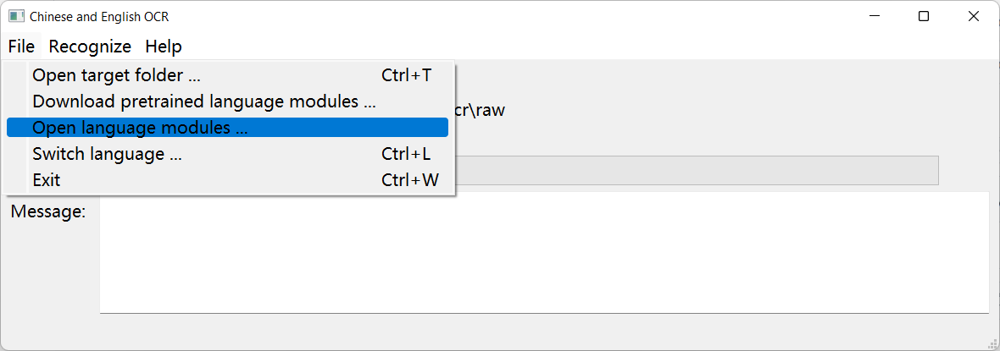
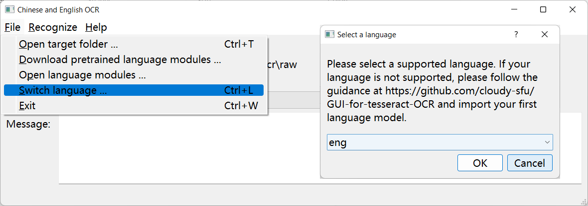

# GUI for "tesseract" OCR

 The GUI for Tesseract OCR software in Windows 64-bit platform

## Install

From release:

1. Unzip and click `GUI-for-tesseract-OCR.exe` to run this program.

From source code:

1. Download the "tesseract" wheel package from https://github.com/simonflueckiger/tesserocr-windows_build/releases For example, the downloaded filename is `tesserocr-2.6.0-cp311-cp311-win_amd64.whl`. Put it at the program root directory, and run `pip install tesserocr-2.6.0-cp311-cp311-win_amd64.whl `.
2. Run `pip install -r requirements.txt`.
3. To compile a release version, run `pyinstaller main.spec`.

## Usage

1. By default, we provide an English language model in the installation package. Click `Help | Version and supported language ` to find installed language models.
    

If the languages you want are not supported: 

3.   Click `File | Download pretrained language models ` to find the language models. The program will call your default web browser and direct you to the download page.
     
4.   Refer to [Language code](https://tesseract-ocr.github.io/tessdoc/Data-Files-in-different-versions.html) to know which file you should download.
5.   Click the file name.
     
6.   Click the download button, waiting the web browser to download this file.
     
7.   Click `File | Open language modules`. Then, the program will automatically call the file explorer and pop up a folder. Move the file you downloaded to the popped-up folder. Finally, close the file explorer.
     
8.   If you want to switch the language, that the OCR program uses, please click `File | Switch language` . In the popped-up dialog "Select a language", choose your language and click "OK".
     
     The current language will appear in the "Language" row in the main window.
9.   Now, you're set up and can choose any item in `Recognize` menu to start an OCR task.

## Acknowledgment

Pretrained OCR models: [Tessdata](https://github.com/tesseract-ocr/tessdata/tree/4767ea922bcc460e70b87b1d303ebdfed0897da8)
